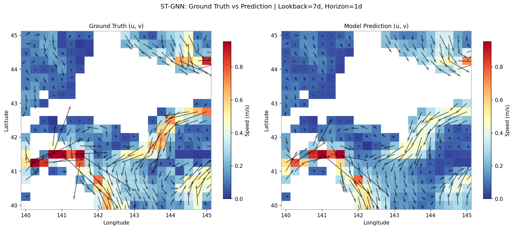
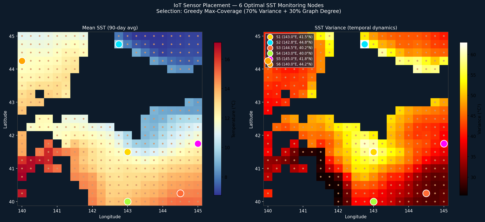

# Hydro-GIFT: Preliminary Proof of Concept
### Flow-Informed Graph Neural Network for Spatial Field Reconstruction

> This repository contains visualizations and results from the preliminary Proof of Concept (PoC) for the **Hydro-GIFT** framework, submitted as part of a JSPS Postdoctoral Fellowship (FY2027) application to Kobe University (Host: Prof. Keisuke Nakayama).

---

## What This PoC Demonstrates

The core claim of Hydro-GIFT is that a **flow-informed Graph Neural Network**, using hydrodynamic velocity fields to define graph edge weights, can reconstruct full spatial field distributions from a minimal number of IoT sensors.

This PoC tests that claim on an open-ocean domain off Hokkaido, Japan using publicly available satellite data (CMEMS), before applying the method to freshwater DIC estimation at Karasuhara Reservoir.

---

## Dataset

| Parameter | Value |
|---|---|
| Source | CMEMS (Copernicus Marine Service) |
| Variable | Sea Surface Temperature (SST) + Current velocity (u, v) |
| Domain | 140–145°E, 40–45°N (Hokkaido offshore) |
| Period | 365 days (2019) |
| Resolution | 0.25° × 0.25° (~1,100 nodes) |
| Sensors simulated | **6 virtual IoT nodes** |

---

## Results

### 1. Flow Field Animation
The hydrodynamic velocity field used to define directed graph edges (W_ij).
The graph edge weights update daily as a function of local current velocity.

---

### 2. Flow-Informed Graph Structure
How the directed graph is constructed from flow vectors: nodes = spatial locations, edges = advective pathways weighted by current speed and direction.

---

### 3. Flow Edge Dynamics
Dynamic edge weight evolution — illustrating how the Richardson-number-based α parameter modulates advective vs. diffusive weighting over time.

---

### 4. Spatial Reconstruction: Ground Truth vs. Model Prediction

ST-GNN reconstruction of the full current velocity field (u, v) from 6 sensors.
Lookback window: 7 days | Prediction horizon: 1 day.

The model captures the dominant flow structures (Tsugaru Warm Current, coastal upwelling zone) without access to the full field during inference.

---

### 5. Optimal IoT Sensor Placement via Graph Centrality

Graph-centrality-based sensor placement (Greedy Max-Coverage: 70% Variance + 30% Graph Degree).
6 nodes selected to maximize spatial reconstruction coverage across 227,000 km².

This directly demonstrates **Methodological Contribution 4** of the Hydro-GIFT proposal: computationally derived optimal sensor coordinates, reducing IoT deployment cost for national-scale monitoring.

---

## Key Takeaway

> Using only **6 sensors** across a **227,000 km²** open-ocean domain, the flow-informed GNN successfully captures directional signal propagation along physical advection pathways. Applied to a bounded lake system (Karasuhara Reservoir) with calmer dynamics and pre-existing 3D simulation archives, substantially higher reconstruction accuracy is expected.

---

## Relevance to Hydro-GIFT (Proposed Research)

| PoC Component | Hydro-GIFT Contribution |
|---|---|
| Flow-informed edge weights (W_ij) | Contribution 1: Flow-Informed Dynamic Graph Topology |
| 6-sensor reconstruction | Contribution 1 validation baseline |
| Graph-centrality sensor placement | Contribution 4: Optimal Sensor Placement |
| Open-ocean → lake transferability | Contribution 3: Cross-Site Transferability |

---

*For questions regarding this PoC, contact the applicant.*
